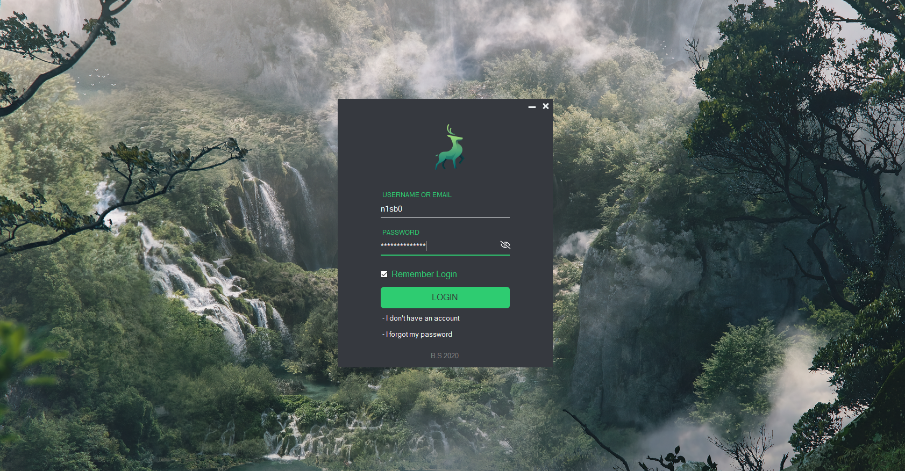
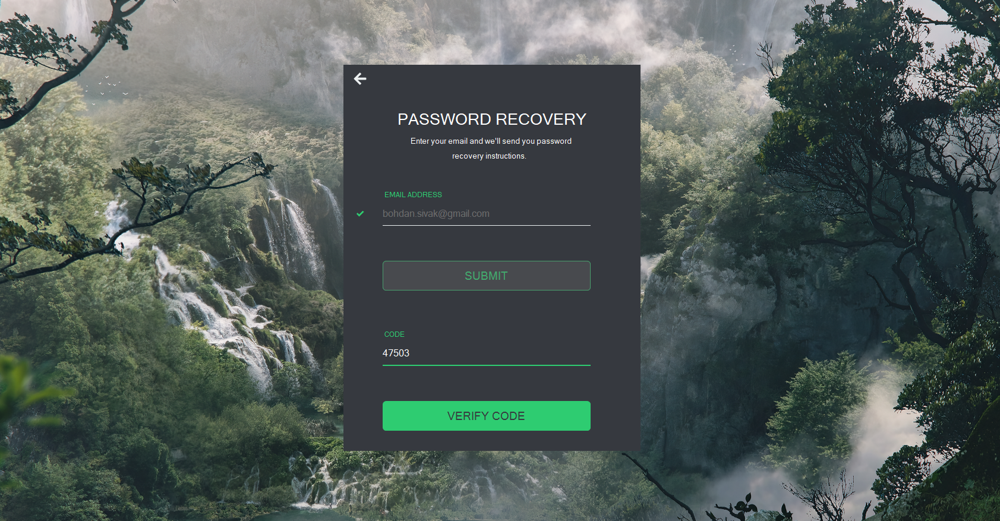
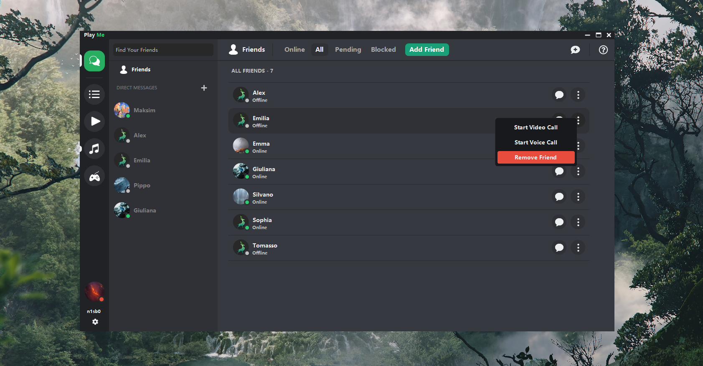
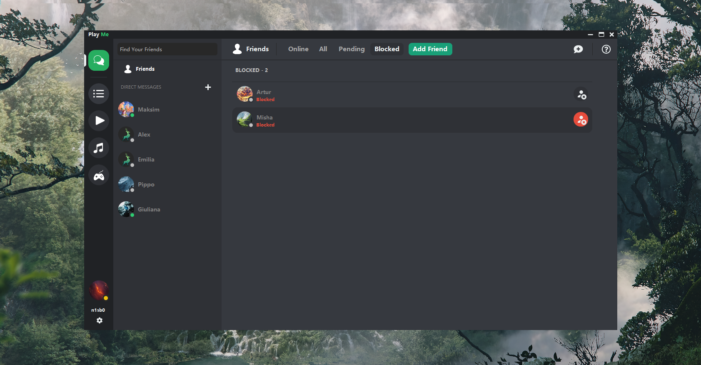
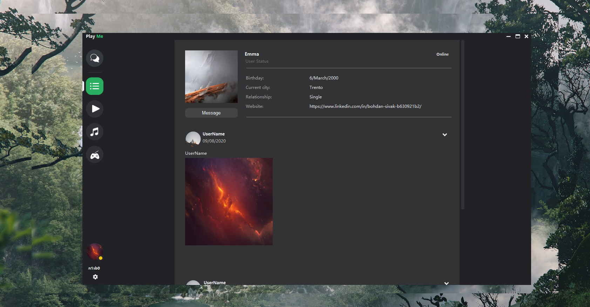

L'applicazione sulla quale sto lavorando ora, che si chiama Play Me, è un'applicazione per windows e cellulari.

Questa non è ancora pronta, la sto sviluppando per creare un comodo UI (User Interface) e per poter aggiungere varie funzioni che potrebbero essere utili al cliente.  
L'applicazione è un misto tra i social-media e il luogo dove potresti guardare i video dei tuo amici o condividerli, ascoltare la musica e giocare.

Il motivo per cui voglio sviluppare questa applicazione è, soprattutto, per confrontarmi con le nuove tecniche e funzioni e imparare a gestirle e metterle in pratica.

----------

The application I'm working on now, called Play Me, is an application for windows and mobile phones.

This is not yet ready, I am developing it to create a comfortable UI (User Interface) and to be able to add various functions that could be useful to the customer.
The application is a mixture of social media and the place where you could watch your friends' videos or share them, listen to music and play games.

The reason why I want to develop this application is, above all, to compare myself with new techniques and functions and to learn how to manage them and put them into practice.

----------

